# Lendora Loan and Credit Risk Platform

Lendora is a full-stack loan origination and credit risk workflow platform. It is built to model how a lending team receives customer applications, collects evidence, runs affordability and risk checks, reviews documents, makes controlled underwriting decisions, and lets customers accept approved loan offers.

Some functionality, including production-style document storage and document OCR, depends on AWS services such as S3 and Textract. The public repository is therefore intended to show the product design, code structure, and local development flow, while selected cloud-backed features require a configured AWS environment. If you are reviewing this project for recruitment or portfolio purposes, please feel free to contact me for the live website link so you can try the deployed version directly.

## What The Platform Does

1. A customer registers or logs in.
2. The customer creates a draft loan application.
3. The customer enters personal, employment, income, expense, loan, consent, and contact details.
4. The customer uploads supporting documents such as identity documents, proof of address, payslips, and bank statements.
5. The customer submits the application.
6. Automated checks run and produce bank-check, affordability, and risk information.
7. Loan officers review the submitted application, documents, evidence flags, and customer details.
8. Staff can run or refresh document OCR, affordability assessment, risk assessment, and automated checks.
9. Underwriters or admins make the final approve, reject, cancel, or freeze decision with decision notes.
10. If approved, the customer can view the repayment schedule and accept the offer.
11. Staff can review the audit trail to see important actions taken on the application.

## Role-Based Functionality

### Customer

Customers use Lendora to apply for loans and track progress.

Customer features include:

- Register and log in with JWT-based authentication.
- View a personal dashboard with application status and next steps.
- Create a new loan application draft.
- Edit a draft before submission.
- Delete a draft that has not been submitted.
- Select a loan product and requested amount.
- Enter employment, income, expenses, dependents, residential status, and existing debt details.
- Provide application consent for credit history checks, income verification, and personal data processing.
- Upload required supporting documents.
- View uploaded document metadata and download allowed documents.
- Submit the application for staff review.
- View submitted application details after the draft is locked.
- View generated repayment schedule when available.
- Accept an approved loan offer.

### Loan Officer

Loan officers focus on operational review and evidence gathering.

Loan officer features include:

- View the staff operations dashboard.
- Open the review queue for submitted applications.
- Search applications by customer details, IC/passport, phone, user id, or application id.
- View full application details.
- Review submitted customer documents.
- Download documents for manual review.
- Mark document review status with reviewer notes.
- Run OCR extraction where configured.
- Run automated bank checks.
- Generate affordability assessments.
- Generate risk assessments.
- Update bank-review notes and staff review information.
- View repayment schedules and decision-support information.
- View audit logs for an application.
- Make permitted workflow updates that help prepare the case for underwriting.

### Underwriter

Underwriters focus on decision quality and final lending outcomes.

Underwriter features include:

- View the review queue and application details.
- Search for customer applications.
- Review documents, bank-check outputs, affordability results, and risk scoring.
- Generate or refresh affordability and risk assessments when needed.
- Review debt service ratio, disposable income, risk grade, risk score, and recommendation.
- Review fraud/KYC flags and decision-support notes.
- Approve, reject, cancel, or freeze an application with a decision note.
- Trigger repayment schedule generation as part of approval.
- View the audit trail for decision accountability.

### Admin

Admins have the broadest access across operations and configuration.

Admin features include:

- All staff review capabilities.
- Create staff or customer accounts.
- Assign a single role to a user.
- Update user name, email, active status, and role.
- Disable or delete users, with safeguards such as preventing an admin from deleting their own account.
- Manage loan products.
- Create loan products with product type, rate, amount limits, term limits, and active status.
- Update existing loan products.
- Deactivate or delete loan products when allowed.
- Review all operational queues and application details.

## Functional Modules

### Authentication And Authorization

The backend uses ASP.NET Core Identity with JWT access tokens and refresh tokens. Role claims drive route access in both the API and frontend. The UI changes navigation based on whether the current user is a customer, staff member, underwriter, or admin.

### Loan Application Workflow

Applications begin as drafts. Customers can edit draft data until submission. After submission, the application becomes a staff-reviewed workflow item. Staff users can review evidence and run checks, while decision actions are controlled by role and application state.

### Document Workflow

Customers can upload document files for an application. The API validates file type and size, stores file metadata, and supports secure document download. Staff can review documents, add notes, update document status, and run OCR extraction where the OCR provider is configured.

Supported upload types include PDF and common image formats such as JPG, PNG, and TIFF.

### Automated Bank Checks

Automated bank checks are implemented as deterministic demo logic. They validate required consents, calculate affordability-related values, produce mock credit and risk signals, and record the result against the application. This gives the workflow realistic decision-support behavior without calling a real credit bureau.

### Affordability Assessment

The affordability module evaluates whether the requested loan is manageable based on income, expenses, existing debt, loan amount, interest rate, and term. It calculates values such as:

- Monthly repayment estimate
- Debt service ratio
- Disposable income
- Affordability result
- Assessment notes

### Credit Risk Assessment

The risk module creates an explainable credit risk result. It considers application inputs, affordability output, mock bureau-style signals, internal scoring, fraud indicators, KYC indicators, and stability factors. It produces:

- Risk score
- Risk grade
- Recommendation
- Review notes
- Decision-support flags

### Repayment Schedule

When an application is approved, Lendora can generate a repayment schedule. The customer and staff can view repayment items, due dates, principal, interest, installment amount, and remaining balance.

### Audit Trail

Important staff and system actions are written to an application audit log. This gives reviewers a timeline of actions such as document review, automated checks, affordability generation, risk scoring, and decision updates.

### Admin Configuration

Admins can manage users and loan products directly from the UI. Product configuration controls which loans customers can apply for, including active status, amount bounds, terms, and interest rates.

## Screenshots

### Login

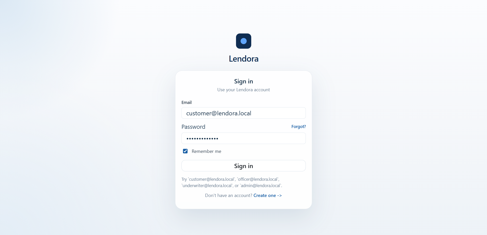

### Customer Dashboard

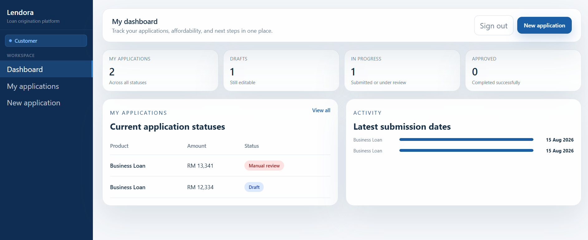

### Create Application

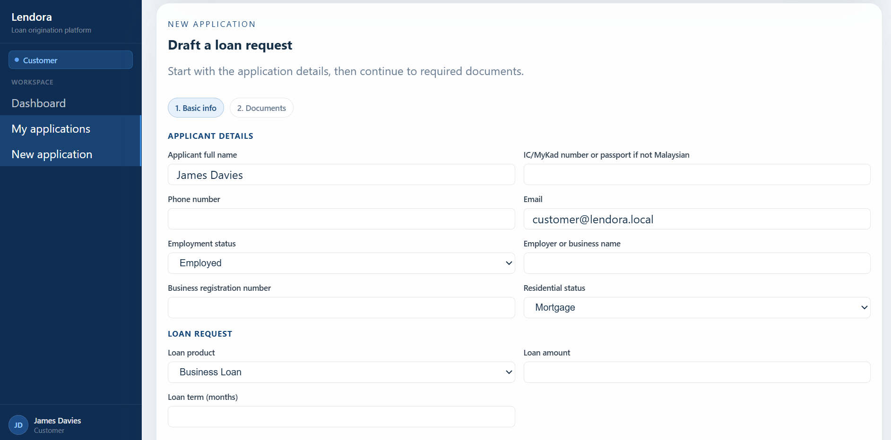

### Document Upload

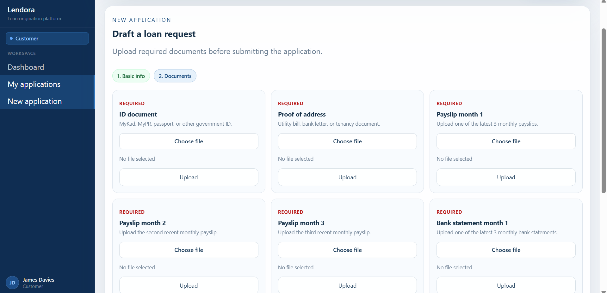

### Staff Review Queue

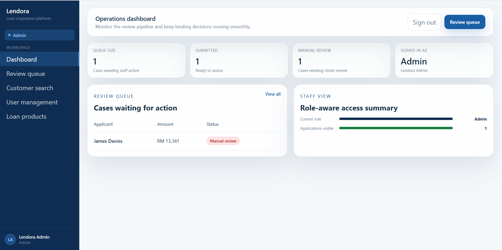

### Staff Application Review

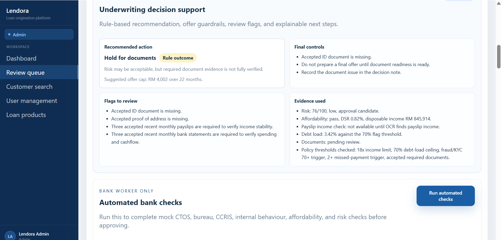

### Risk And Affordability

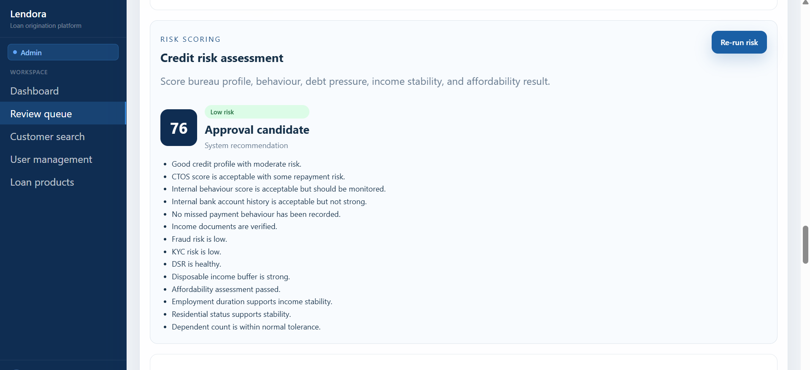

### Documents OCR

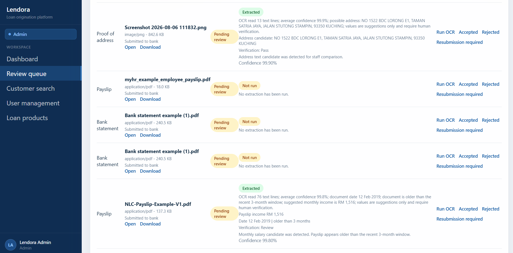
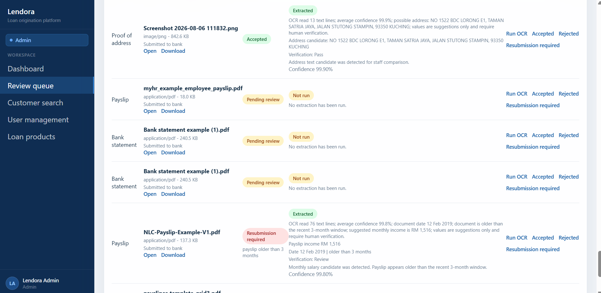

### Repayment Schedule

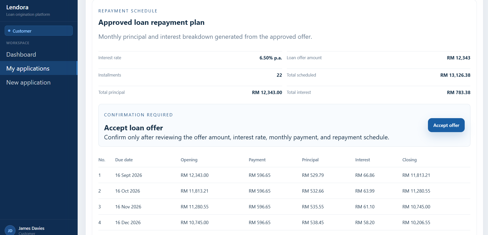

### Admin Management

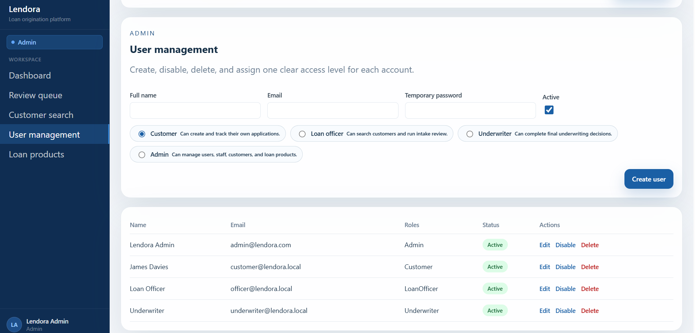

### Loan Product Management

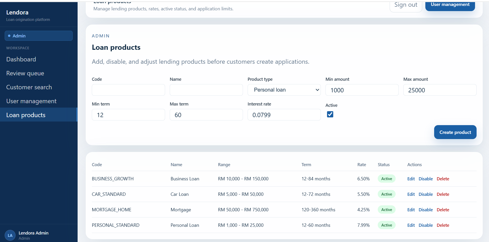

## Tech Stack

| Area | Technology |
| --- | --- |
| Backend | ASP.NET Core, C# |
| Application data | Entity Framework Core |
| Database | PostgreSQL |
| Authentication | ASP.NET Core Identity, JWT, refresh tokens |
| Frontend | React, TypeScript, Vite |
| Styling | Custom CSS |
| Local runtime | Docker Compose for PostgreSQL |
| Testing | xUnit, TypeScript compiler check |

## Demo Accounts

These accounts are seeded for local development only.

| Role | Email | Password |
| --- | --- | --- |
| Customer | `customer@lendora.local` | `Customer12345` |
| Loan Officer | `officer@lendora.local` | `Officer12345` |
| Underwriter | `underwriter@lendora.local` | `Underwriter12345` |
| Admin | `admin@lendora.local` | `Admin12345` |

## Local Setup

Prerequisites:

- .NET 10 SDK
- Node.js
- Docker Desktop

## Known Limitations

- Credit bureau integrations are mocked for demo and portfolio purposes.
- OCR extraction is designed as an integration path. Real production-grade payslip and bank-statement extraction would need stronger document parsing, confidence scoring, template handling, and human confirmation.
- Email notifications, offer expiry jobs, disbursement tracking, and repayment collection are future enhancements.
- Demo credentials and local configuration are intended for development only.

